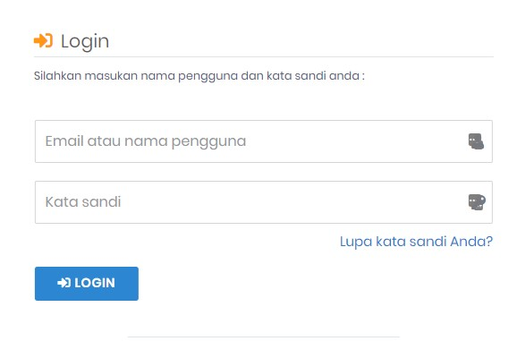
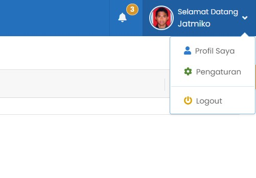
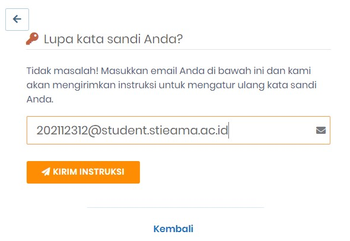

# Login

## Login ke SIAKAD (Mahasiswa)

Silahkan klik link dibawah ini atau _copy paste_ alamat url ke dalam kolom alamat / address pada _browser_ anda

:::info URL Siakad STIEAMA

URL : https://siakad.stieama.ac.id

:::

> Masukan _nama pengguna_ berupa NIM dan _kata sandi_ kemudian klik Tombol Login [^1]

:::caution Perhatian

Username (NIM) dan Password bisa didapatkan di bagian akademik.
PENTING! Setelah anda berhasil login menggunakan password default yang diberikan, Anda wajib [mengganti password](#ubah-password) dengan password baru yang anda ciptakan sendiri.

:::

## Logout

Setelah anda berhasil login kedalam akun SIAKAD Anda, jika sudah selesai dengan pekerjaan yang anda lakukan.
Sebaiknya anda melakukan logout. Untuk melakukan logout, Silahkan klik pada pojok kanan atas, dan Pilih menu Logout

## Lupa Password

Untuk melakukan reset Kata Sandi, bisa anda lakukan sendiri.
ikuti langkah-langkah sebagai berikut :

- klik _Lupa kata sandi Anda?_ pada halaman login
- ketik alamat email anda yang terdaftar dalam sistem SIAKAD
- email berisi _token_ dan instruksi cara mengganti password akan terkirim via _email_

### Mereset Password

- Akses halaman **[Halaman Reset Password](https://siakad.stieama.ac.id/reset-password)**
- Masukan kode token yang terkirim via email
- Masukan E-Mail Anda
- Masukan Password baru
- Ketik Ulang Password baru

## Ubah Password

[^1]: Format ini khusus untuk Mahasiswa
