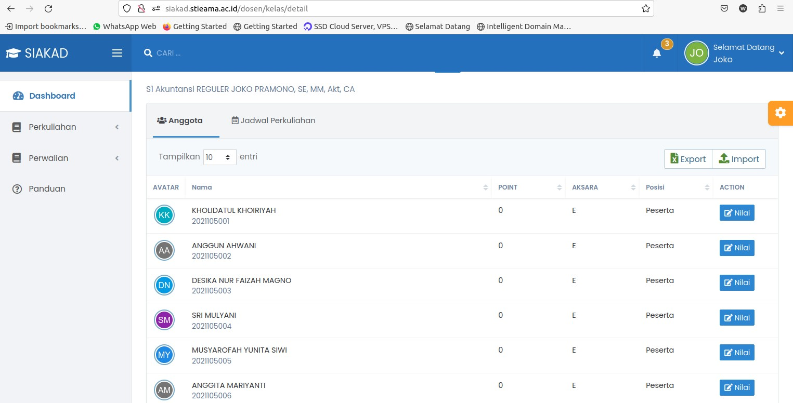
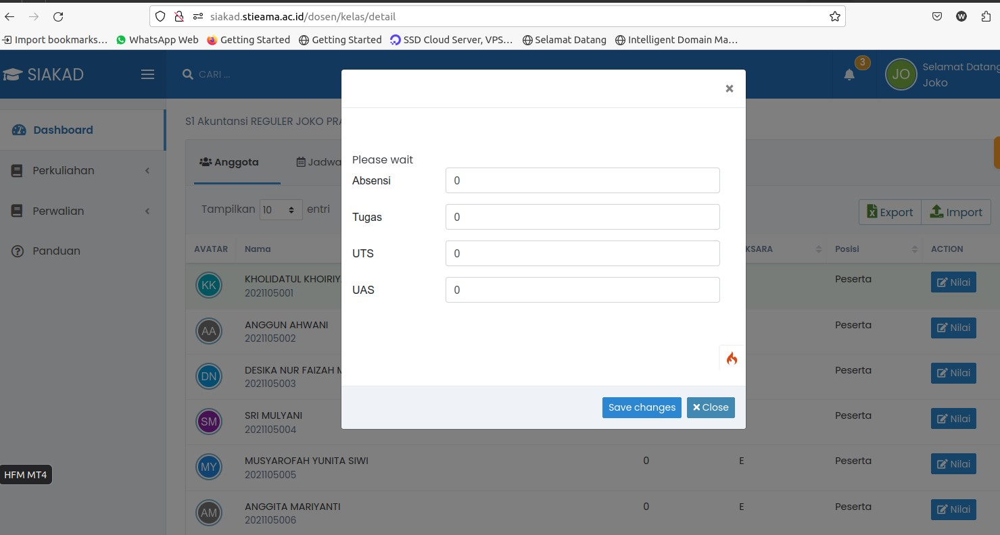

# Input Nilai

## Langkah Input Nilai

:::info Download PDF Format

Panduan ini juga dapat di download dalam format PDF, klik link dibawah ini untuk mendownload :

[Download Panduan SIAKAD STIEAMA](../dosenwali/assets/buku-manual-siakad-stieama.pdf)

:::

Cara Input Nilai siakad.stieama.ac.id

1. Login ke http://siakad.stieama.ac.id
   
2. Klik Menu Perkuliahan → Kelas Saya
   
3. Klik tombol detail kelas pada untuk kelas yang akan input nilai
   
4. Klik tombol Nilai pada mahasiswa yang akan input nilai
   
5. Masukkan nilai sesuai persentase masing-masing point penilaian, misal
   

- Absensi : 20
- Tugas: 10
- UTS : 30
- UAS : 40

6. Klik save changes,
7. Ulangi untuk setiap mahasiswa dan setiap kelas
