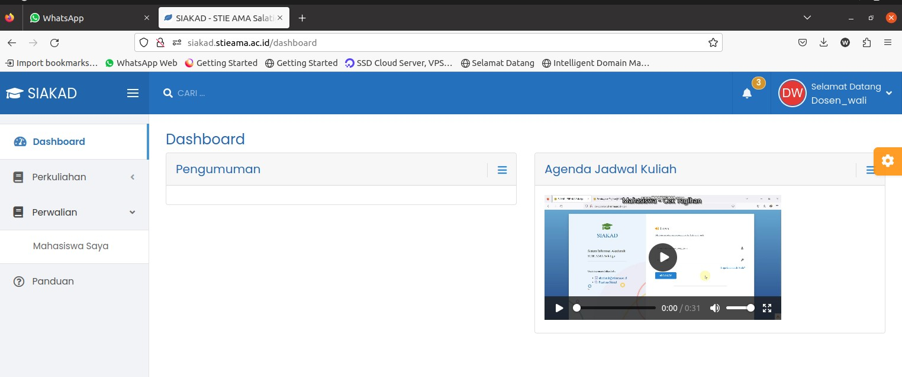
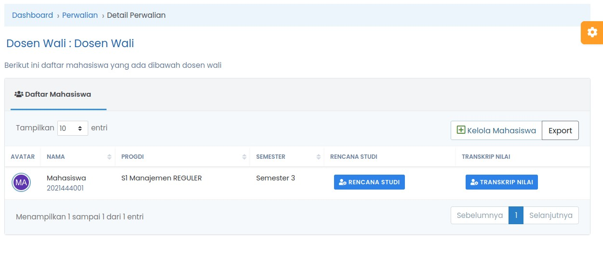
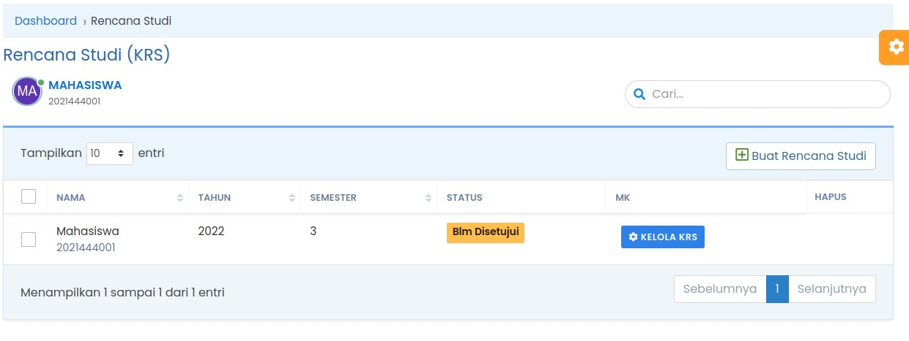
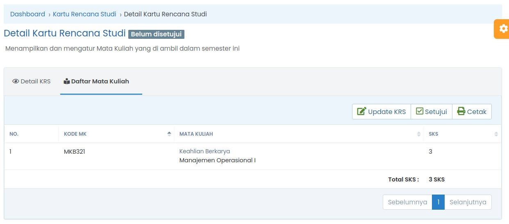
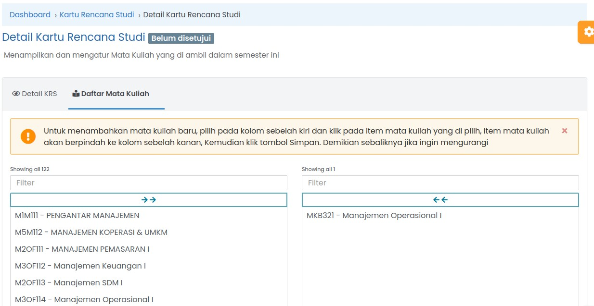
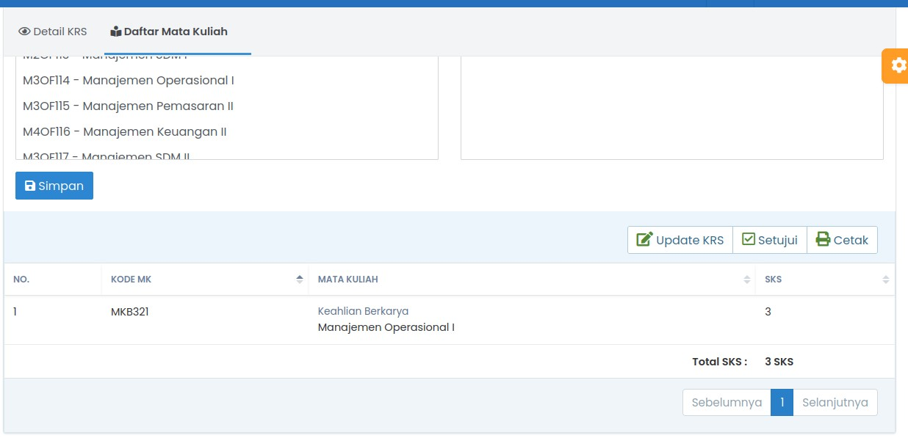

# Perwalian

## Langkah Perwalian

:::Download PDF Format

Panduan ini juga dapat di download dalam format PDF, klik link dibawah ini untuk mendownload :

[Download Panduan SIAKAD STIEAMA](../assets/buku-manual-siakad-stieama.pdf)

:::

Sebagai dosen wali, maka dosen tersebut memiliki Hak akses untuk mengatur KRS matakuliah mahasiswa yang ada dibawah perwaliannya. Pada menu ini Dosen wali bisa menambah atau mengurangi matakuliah pada daftar KRS yang dibuat mahasiswa. Selanjutnya Dosen Wali bisa melakukan persetujuan atas KRS tersebut dan ditetapkan untuk dilaksanakan pada semester yang bersangkutan.

Menu Perwalian digunakan untuk mengatur matakuliah yang diambil oleh mahasiswa dibawah perwalian dosen.

1. Menu Perwalian - > Mahasiswa Saya
   

2. Klik tombol Rencana Studi pada baris mahasiswa yang akan di kelola KRS nya
   

3. Untuk Mengelola Rencana Studi - > Klik tombol Kelola KRS
   

4. Berikutnya klik Tab Daftar Mata Kuliah - > Klik Update KRS
   

5. Detail Kartu Rencana Studi
   Pada menu ini ada 2 kolom di kiri dan dikanan, kolom kiri adalah daftar semua matakuliah, sedangkan kolom sebelah kanan adalah matakuliah yang diambil oleh mahasiswa. Dosen wali bisa mengedit daftar matakuliah yang diambil oleh mahasiswa.  
   Untuk menambah matakuliah, klik pada matakuliah yang dimaksud pada daftar sebelah kiri, maka matakuliah tersebut akan berpindah ke kanan. Untuk menghapus matakuliah dengan cara klik pada matakuliah yang dimaksud pada daftar sebelah kanan, maka matakuliah akan hilang dari daftar. Setelah selesai di edit berikutnya klik simpan.
   

6. Setelah semua benar maka KRS tersebut bisa disetujui dengan cara klik tombol setujui. KRS yang sudah disetujui tidak bisa diubah lagi.
   

7. Cetak KRS
   Tombol cetak digunakan untuk download file excel yang berisi KRS dan dapat langsung di cetak ke kertas.
