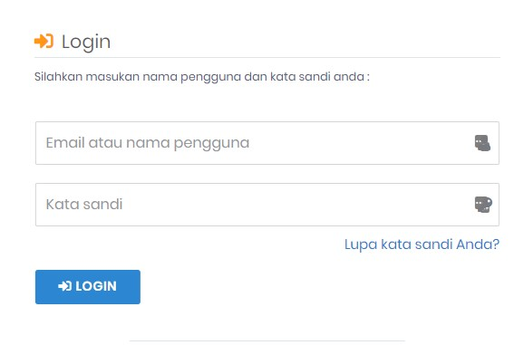

# Login

## Cara Login ke SIAKAD (Mahasiswa)

Silahkan klik link dibawah ini atau _copy paste_ alamat url ke dalam kolom alamat / address pada _browser_ anda

:::info URL Siakad STIEAMA

URL : https://siakad.stieama.ac.id

:::

> Masukan _nama pengguna_ dan _kata sandi_ dengan format sebagai berikut :  
> **Nama Pengguna** di isi dengan NIM  
> **Kata Sandi** di isi dengan NIM + 3 Huruf depan nama mahasiswa (Huruf kapital)

> **Contoh :**
>
> - NIM : 202212312
> - Nama : Ahmad Sudjatmiko

Maka Password anda adalah : **202212312AHM** [^1]

:::caution Perhatian

Password tersebut diatas, adalah password default anda.  
setelah anda berhasil login menggunakan password diatas, Anda wajib mengganti password dengan password baru yang anda ciptakan sendiri.

:::

[^1]: Format ini khusus untuk Mahasiswa
