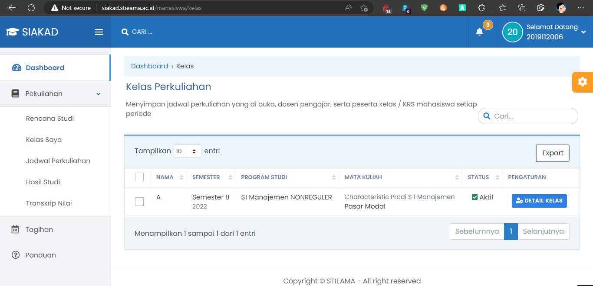

# Kelas

Didalam menu Kelas Saya, berisi daftar Kelas yang sedang di ikuti oleh Mahasiswa.

### Detail Kelas

Pada Setiap Kelas yang di ikuti, Mahasiswa dapat melihat detail kelas dengan Klik tombol “Detail Kelas” pada masing-masing baris kelas yang tersedia.  
Didalam menu detail kelas, Mahasiswa dapat melihat :

- Daftar Mahasiswa dan Dosen Pengampun
- Jadwal Perkuliahan (Jika tersedia) - Jadwal Perkuliahan berisi Tanggal dan Waktu Pertemuan dan Ruangan

**Tips :**

- Pastikan Anda terdaftar pada kelas sesuai dengan mata kuliah yang Anda ambil, jika kelas pada mata kuliah yang Anda ambil tidak ada atau belum tersedia, silahkan konsultasikan dengan bagian Administrasi
