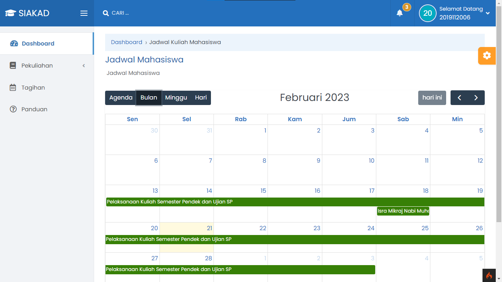

# Jadwal Perkuliahan

Fitur Kalender Akademik dan Jadwal Perkuliahan pada SIAKAD merupakan fitur yang sangat penting bagi mahasiswa dalam mengelola kegiatan akademik mereka. Fitur Kalender Akademik memungkinkan mahasiswa untuk melihat jadwal kegiatan akademik seperti awal dan akhir semester, cuti semester, ujian, libur, dan acara-acara penting lainnya. Dengan adanya fitur ini, mahasiswa dapat merencanakan kegiatan mereka dengan lebih efektif.

Sedangkan fitur Jadwal Perkuliahan memungkinkan mahasiswa untuk melihat jadwal kuliah yang diikuti pada setiap semester. Jadwal ini mencakup informasi tentang waktu, tempat, dan dosen pengajar yang bertanggung jawab atas mata kuliah tersebut. Dengan adanya fitur ini, mahasiswa dapat mengelola waktu mereka dengan lebih baik dan memastikan bahwa mereka tidak melewatkan kuliah yang penting.

Selain itu, fitur Jadwal Perkuliahan pada SIAKAD juga mencakup informasi tentang hari libur nasional atau event nasional lainnya, sehingga mahasiswa dapat memperkirakan jadwal kuliah mereka dengan lebih baik. Dengan fitur ini, mahasiswa juga dapat mengelola waktu mereka dengan lebih baik dan memastikan bahwa mereka tidak melewatkan kuliah yang penting.

Secara keseluruhan, fitur Kalender Akademik dan Jadwal Perkuliahan pada SIAKAD sangat penting bagi mahasiswa untuk mengelola kegiatan akademik mereka. Dengan adanya fitur ini, mahasiswa dapat merencanakan dan mengatur jadwal mereka dengan lebih baik, sehingga dapat memaksimalkan pencapaian akademik mereka di institusi pendidikan tinggi.
