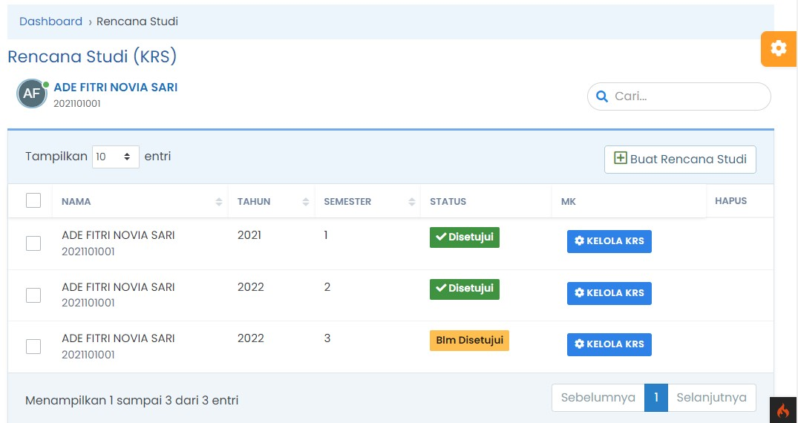
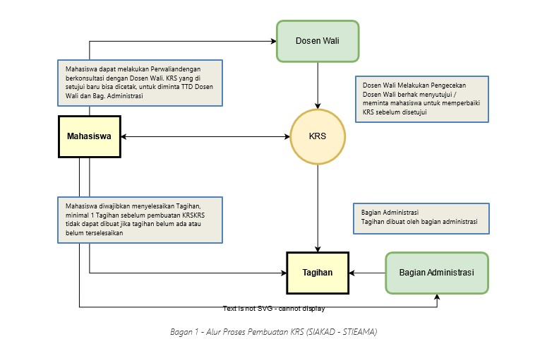
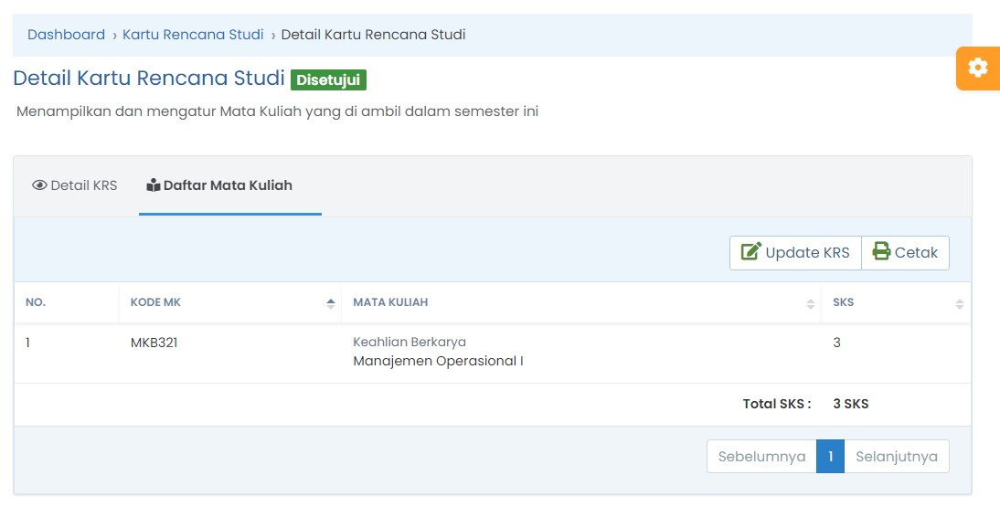
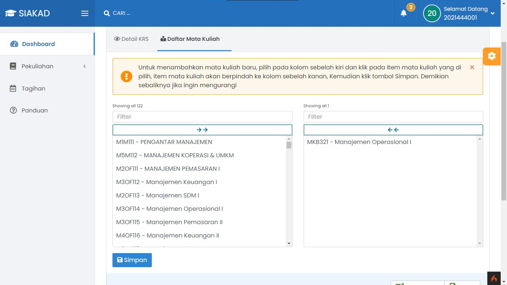

# Rencana Studi

## Rencana Studi Mahasiswa

Menu Rencana Studi adalah daftar Rencana Studi yang dibuat mahasiswa berdasarkan paket perkuliahan sesuai dengan Jurusan Program Studi yang diambil, Berikut ini fitur yang ada dalam menu Rencana Studi

- Menampilkan daftar Rencana Studi berdasarkan tahun, semester yang ditempuh dan ditandai dengan di Setujui atau Belum di Setujui
- Membuat Rencana Studi Baru
- _Mengelola / Update_ Rencana Studi yang sudah buat sebelumnya dengan catatan, KRS belum disetujui
- Menghapus Rencana Studi
- Mengunduh Kartu Rencana Studi

## Membuat Rencana Studi

Berikut ini langkah-langkah untuk membuat KRS (Kartu Rencana Studi)

- [Login](../../autentikasi/cara-login.md) ke SIAKAD
- Masuk ke menu _**Perkulianan**_, dan pilih Sub Menu _**Rencana Studi**_

Untuk lebih detail, bisa lihat video tutorial dibawah ini :

<iframe width="560" height="315" src="https://www.youtube.com/embed/-3pO1G4Yaho" title="YouTube video player" frameborder="0" allow="accelerometer; autoplay; clipboard-write; encrypted-media; gyroscope; picture-in-picture" allowfullscreen></iframe>

### Flowchart Siklus pembuatan KRS

- Bag. Administrasi menerbitkan tagihan
- Mahasiswa membayar tagihan biaya perkuliahan
- Mahasiswa membuat KRS dengan klik tombol Buat Rencana Studi pada menu Perkuliahan > Rencana Studi
- Mahasiswa dapat mengelola KRS selama KRS belum di setujui oleh Dosen Wali
- Dosen Wali melakukan pengecekan KRS Mahasiswa, dan berhak memperbaiki KRS Mahasiswa sebelum di setujui
- KRS Disetujui oleh Dosen Wali, mahasiswa dapat mencetak KRS dan meminta TTD ke Dosen Wali dan Bag. Administrasi

### Tips Membuat Rencana Studi

- Sebelum melakukan pembuatan KRS, pastikan Anda sudah melakukan pembayaran minimal 1 tagihan biaya perkuliahan pada semester
- Konsultasikan ke bagian Administrasi jika ada kendala dengan tagihan dan pembayaran, KRS tidak dapat dibuat jika tagihan belum terselesaikan, minimal 1 tagihan
- KRS yang sudah di setujui oleh Dosen Wali tidak dapat diubah kembali, konsultasikan dengan Dosen Wali jika ada perubahan
- KRS yang belum di setujui tidak dapat dicetak, Konsultasikan kepada Dosen Wali jika Anda ingin mencetak KRS

## Mengelola Rencana Studi

Pembuatan KRS secara otomatis menambahkan Daftar Mata Kuliah sesuai Program Studi dan Semester, namun demikian Mahasiswa masih dapat mengelola dengan menambahkan atau mengurangi Mata Kuliah yang diambil
Untuk mengelola KRS, bisa dilakukan dengan klik tombol “Kelola KRS”, didalam menu kelola KRS mahasiswa dapat melihat Daftar Mata Kuliah ada tab Daftar Mata Kuliah yang berisi daftar mata kuliah berisi KODE MK, Nama MK dan SKS (Satuan Kredit Semester)

### Update Rencana Studi

Untuk mengatur atau mengelola daftar Mata Kuliah, Mahasiswa dapat Klik pada tombol “Update KRS”

:::caution Cara Update KRS

Untuk menambahkan mata kuliah baru, pilih pada kolom sebelah kiri dan klik pada item mata kuliah yang di pilih, item mata kuliah akan berpindah ke kolom sebelah kanan, Kemudian klik tombol Simpan. Demikian sebaliknya jika ingin mengurangi
:::

Tips :

- Konsultasikan kepada Dosen Wali, ketika Anda melakukan update pada KRS

### Mengunduh Kartu Rencana Studi

Untuk mengunduh Kartu Rencan Studi dapat mengikuti langkah-langkah sbb :

- Masuk ke menu Rencana Studi
- Kemudian Pilih semeseter yang di inginkan, lalu klik tombol **Kelola KRS**
- Klik tombol **Cetak** pada bagian kanan atas KRS

### Menghapus Rencana Studi
