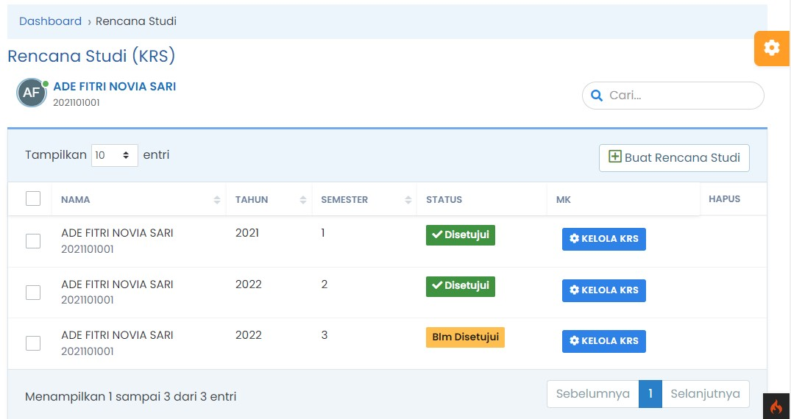

# Rencana Studi

## Rencana Studi Mahasiswa

Menu Rencana Studi adalah daftar Rencana Studi yang dibuat mahasiswa berdasarkan paket perkuliahan sesuai dengan Jurusan Program Studi yang diambil, Berikut ini fitur yang ada dalam menu Rencana Studi

- Menampilkan daftar Rencana Studi berdasarkan tahun, semester yang ditempuh dan ditandai dengan di Setujui atau Belum di Setujui
- Membuat Rencana Studi Baru
- _Mengelola / Update_ Rencana Studi yang sudah buat sebelumnya dengan catatan, KRS belum disetujui
- Menghapus Rencana Studi
- Mengunduh Kartu Rencana Studi

## Membuat Rencana Studi

Berikut ini langkah-langkah untuk membuat KRS (Kartu Rencana Studi)

- [Login](../../autentikasi/cara-login.md) ke SIAKAD
- Masuk ke menu _**Perkulianan**_, dan pilih Sub Menu _**Rencana Studi**_

### Tips Membuat Rencana Studi

## Mengelola Rencana Studi

### Update Rencana Studi

### Mengunduh Kartu Rencana Studi

### Menghapus Rencana Studi
